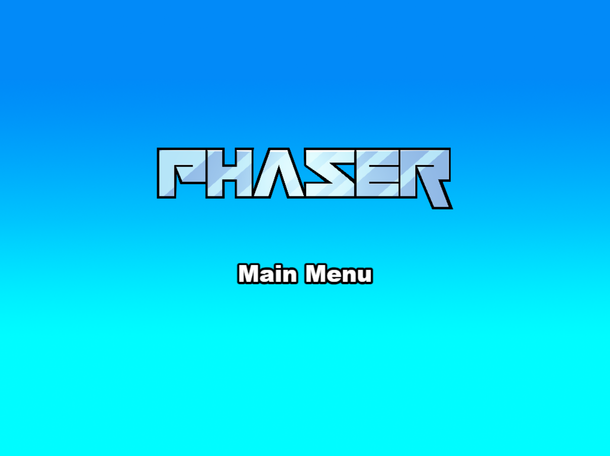

# 2D Enemy Waves

## 1. Elementos do grupo
- Nome: [PREENCHER]
- Numero: [PREENCHER]

## 2. Tecnologias e dependencias
- Phaser: `3.90.0`
- Integracao do Phaser: `npm`
- Bundler: `Vite`
- Scripts principais:
  - `npm run dev`
  - `npm run build`
  - `npm run dev-nolog`
  - `npm run build-nolog`

## 3. Descricao do jogo
`2D Enemy Waves` e um jogo 2D de acao e sobrevivencia em arena. O jogador controla uma Wraith, enfrenta ondas sucessivas de zombies, recolhe essencia e investe pontos em upgrades para sobreviver mais tempo e evoluir a personagem.

O ciclo principal do jogo e: menu -> jogo -> combate por waves -> recolha de essencia -> upgrades/evolucao -> derrota ou vitoria. A run termina em `Game Over` quando a vida chega a zero, ou em `Vitoria` ao limpar a wave 10.

## 4. Genero, objetivo, regras e funcionalidades
- Genero: acao / sobrevivencia em arena 2D
- Objetivo: sobreviver as waves, derrotar inimigos, melhorar a build e chegar ao fim da run
- Regras principais:
  - cada inimigo derrotado pode largar essencia;
  - a essencia permite investir nos upgrades da build;
  - a personagem evolui ao atingir certos patamares de pontos gastos;
  - morrer termina a run;
  - limpar a wave 10 ativa a vitoria.
- Funcionalidades implementadas:
  - movimento do jogador;
  - ataque melee e cast a distancia;
  - colisao com o mapa via Arcade Physics;
  - HUD com vida, score, wave, inimigos e progresso da build;
  - menu principal;
  - menu de build/evolucao;
  - `Game Over` e `Vitoria`;
  - reinicio rapido da run;
  - suporte PT/EN;
  - efeitos sonoros de combate, recolha e fim de jogo.

## 5. Controlos
- `WASD`: mover
- `J`, `SPACE`, `K` ou clique esquerdo: atacar
- `E` ou clique direito: cast / habilidade
- `U`: abrir / fechar menu de build
- `N`: evoluir a personagem quando disponivel
- `1-6`: investir pontos nos upgrades
- `R`: reiniciar a run
- `ESC`: fechar o menu de build

## 6. Como executar
### Desenvolvimento
```bash
npm install
npm run dev
```

O Vite arranca por omissao em `http://localhost:8080`.

### Build de producao
```bash
npm run build
```

O output final fica na pasta `dist/`.

## 7. Aspetos multimedia
### Imagens
- **Mapa**: tiles do pack `Prototype Pack (2.3)` de Kenney, com licenca `CC0`, conforme `public/assets/map/License.txt`.
- **Inimigos**: sprites de zombies provenientes de packs com licenca Craftpix, conforme `public/assets/enemy/License.txt`.
- **Jogador**: sprites `Wraith` provenientes de pack com licenca Craftpix, conforme `public/assets/player1/TXT/license.txt`.

### Formatos e tamanhos usados em runtime
- Background principal: `PNG`, `1024x768`
- Tile de piso do mapa: `PNG`, `256x512`
- Frame do jogador `Wraith_01_Idle_000`: `PNG`, `520x420`
- Frame do inimigo `Zombie1 Idle1`: `PNG`, `222x372`

### Justificacao visual
- Os sprites de origem sao maiores do que o tamanho final em jogo, o que permite reduzi-los em Phaser sem perder legibilidade.
- O mapa usa poucas pecas do tileset para manter o preload simples e coerente com a arena.

### Audio
- Os efeitos sonoros foram gerados especificamente para este projeto e guardados em `public/assets/audio/`.
- Formato: `WAV`
- Ficheiros usados:
  - `attack.wav` - ~0.09s - ~4 KB
  - `pickup.wav` - ~0.12s - ~5 KB
  - `gameover.wav` - ~0.26s - ~11 KB
- Eventos com audio:
  - ataque melee;
  - recolha de essencia;
  - morte / fim da run.

### Otimizacao e limpeza de assets
- Foram removidos assets nao usados em runtime, incluindo ficheiros `.ai`, `.eps`, `.unitypackage`, `.zip`, `.url`, sprites de teste e partes vetoriais nao carregadas pelo jogo.
- A pasta `public/assets` passou de uma colecao de trabalho bruta para um conjunto focado nos ficheiros realmente carregados pelo jogo.

## 8. Estrutura do projeto
- `src/game/main.js`: configuracao do Phaser
- `src/game/scenes/Boot.js`: inicializacao e settings
- `src/game/scenes/Preloader.js`: preload de imagens e audio
- `src/game/scenes/MainMenu.js`: menu principal e escolha de idioma
- `src/game/scenes/Game.js`: gameplay principal, HUD, waves, inimigos e upgrades
- `src/game/scenes/GameOver.js`: ecra final de derrota / vitoria
- `src/game/data/`: personagens, animacoes, mapa, upgrades, inimigos e settings
- `src/game/i18n/`: traducoes PT/EN

## 9. Repositorio e versao entregue
- URL do repositorio: `https://github.com/JotaBarbosaDev/2DGame-EnemyWaves`
- Commit hash entregue: commit apontado pela tag `1.0` (obter com `git rev-list -n 1 1.0`)
- Tag: `1.0`

## 10. Screenshot


## 11. Lacunas conhecidas / roadmap
- Falta preencher os dados finais do grupo no README e no ficheiro de entrega.
- O audio foi mantido minimalista para cumprir o requisito com baixo impacto no tamanho final.
